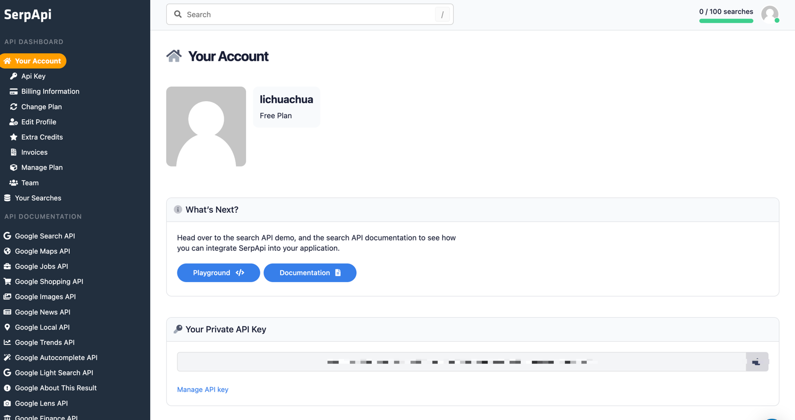
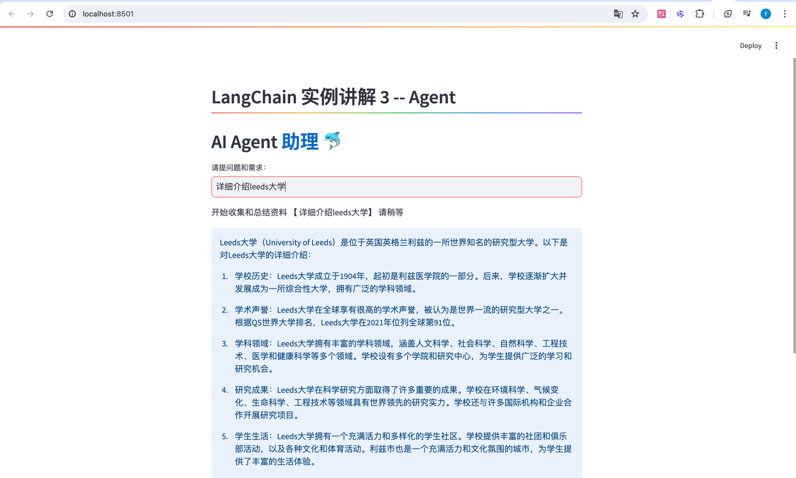
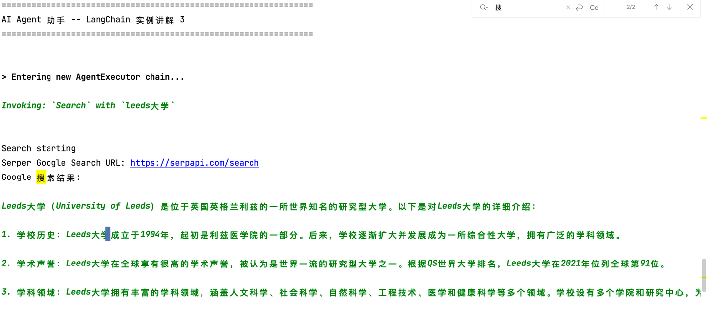

1.准备好OPENAI_API_KEY
> export OPENAI_API_KEY=""  
> 
2.在https://serpapi.com/创建好SERPER_API_KEY

> export SERPER_API_KEY=""
> 
3.下载包：
> pip install streamlit
> 
4.运行代码
> streamlit run main.py
> 
5.在弹出的浏览器界面输入问题

6.查看Agent的工具调用
（如果是属于GPT知识不够，需要从浏览器搜索的会出现以下的调用）

**说明**

这次一共实现了两个Agent的工具：
第一个工具：在配置工具时，需要声明工具依赖的函数，由于该示例实现的功能为依赖网络收集相应的信息，然后汇总成一篇论文，所以创建了一个search函数，这个函数用于调用Google搜索。它接受一个查询参数，然后将查询发送给Serper API。API的响应会被打印出来并返回。
第二个工具函数，这里用了另一种声明工具的方式Class声明—— ScrapeWebsiteTool()，用于爬取网站并进行总结返回结果。
**爬虫由于api现在不免费先不实现**

# AI_Agent
## LangChain Tutorial 3  
## 动画演示透彻解释 Agent 概念 以及 实现Demo 

 ## 涉及工具
* Serper
* Browserless

## 使用前
* 运行前，请务必先自行完善 .env文件中的参数。包括但不限于各类 API key\Secret Key等。
* 如果有疑问, 欢迎 email: 798800165@qq.com

## .env文件必要参数 list
* OPENAI_API_KEY=
* SERPER_API_KEY=
* BROWSERLESS_API_KEY=
  
## 视频讲解
* B站       https://www.bilibili.com/video/BV1JV411F7Yj/
* youtube   https://youtu.be/_lyE6T0njWQ

## 小小声明

### 本项目代码均为演示 Demo 和授课讲解用，因为不是生产环境使用且时间仓促原因，代码质量请各位包涵，如果实际应用，请务必按照代码规范完善，谢谢
